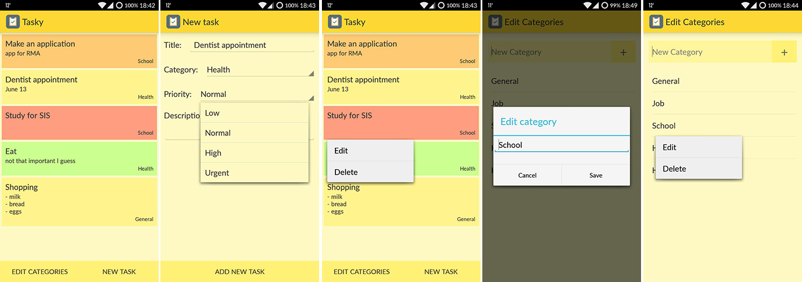

Tasky - App for saving your tasks
=================================

Faculty of Electrical Engineering, Computer Science and Information Technology Osijek  
Mobile platform application development  
Third Homework

## Requirements

* Create ListActivity which will serve as home screen
* Populate list using database
* Create class named Task with atributes for (at least) title, description and priority
* Design list item in XML
* Create DBHelper class
* Create Activity for creation of new tasks
* Implement delete functionality for tasks on long click

## Screenshots

## Resources

* [Recycler view onItemClick](http://stackoverflow.com/questions/28296708/get-clicked-item-and-its-position-in-recyclerview)
* [SQLiteDatabase documentation](https://developer.android.com/reference/android/database/sqlite/SQLiteDatabase.html)
* [Icon](https://icons8.com/)
